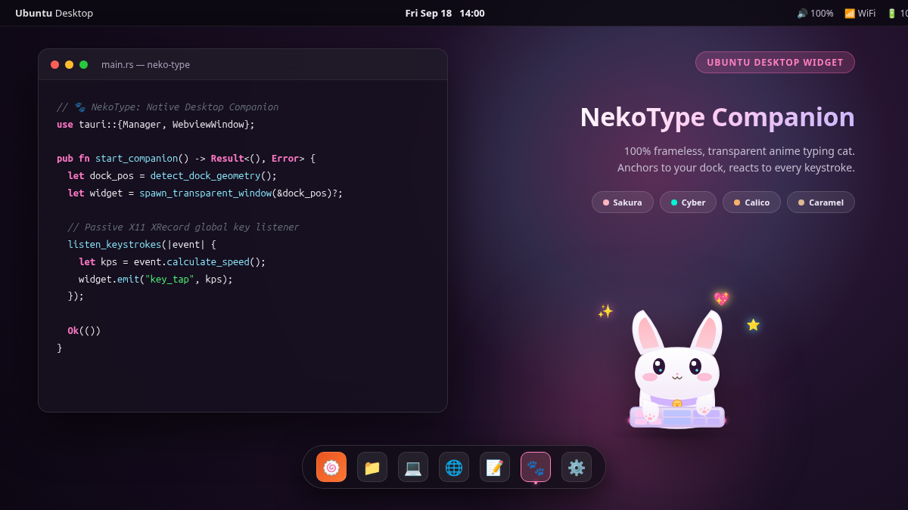
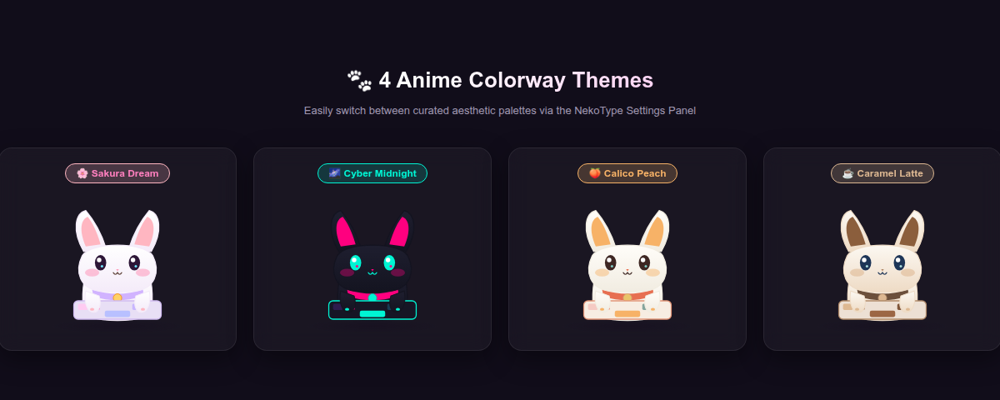

<div align="center">


# 🐾 NekoType

### *Lightweight Native Anime Typing Companion for Ubuntu GNOME*

[](https://github.com/ngoc-thu/neko-type/releases)
[](https://ubuntu.com)
[](https://tauri.app)
[](LICENSE)
[]()

<br/>



<br/>
<em>NekoType sitting comfortably on top of the Ubuntu dock, reacting to global keystrokes in real-time.</em>

</div>

---

## 🌟 Overview

**NekoType** is an original, lightweight native desktop companion widget inspired by the "Bongo Cat" concept. It features a cute anime chibi cat ("Neko") sitting behind a miniature mechanical keyboard beside your Ubuntu dock.

Designed to feel like an organic part of the Ubuntu desktop and dock rather than an application window:
- **100% Transparent & Frameless**: No title bar, no window border, no background box.
- **Dock-Aligned**: Anchors right above or beside the Ubuntu dock.
- **Dedicated Settings Panel**: Clean anime-styled glassmorphic window to adjust themes, scale, and positioning.
- **Zero Distraction**: No clutter in your GNOME top bar or Alt-Tab switcher (`skip_taskbar: true`).
- **Pass-through Focus**: Interacting with the widget never steals keyboard focus from your terminal or IDE.
- **Ultra-Low Resource Usage**: Native Rust + WebKitGTK with hardware-accelerated CSS transforms (<0.3% idle CPU, <40MB RAM).

---

## 📦 Installation & Download

### Option 1: Install with `.deb` Package (Recommended)

Download the latest `.deb` installer from the **[GitHub Releases](https://github.com/ngoc-thu/neko-type/releases)** page:

```bash
# 1. Download the release deb package
wget https://github.com/ngoc-thu/neko-type/releases/download/v1.0.0/neko-type_1.0.0_amd64.deb

# 2. Install using apt (automatically handles dependencies)
sudo apt install ./neko-type_1.0.0_amd64.deb
```

Once installed, **NekoType** and **NekoType Settings** will be available directly in your Ubuntu Application launcher (Super key).

To uninstall:
```bash
sudo apt remove neko-type
```

---

### Option 2: Portable Tarball

If you prefer running without installing system packages:

```bash
# 1. Download and extract
wget https://github.com/ngoc-thu/neko-type/releases/download/v1.0.0/neko-type_1.0.0_linux_x86_64.tar.gz
tar -xzf neko-type_1.0.0_linux_x86_64.tar.gz
cd neko-type-1.0.0

# 2. Run
./run.sh start
```

---

### Option 3: Build from Source

#### Prerequisites
- Ubuntu 22.04 or 24.04 LTS
- Node.js $\ge$ 18 & pnpm (`npm install -g pnpm`)
- Rust toolchain (`curl --proto '=https' --tlsv1.2 -sSf https://sh.rustup.rs | sh`)
- System libraries:
  ```bash
  sudo apt update
  sudo apt install -y libwebkit2gtk-4.1-dev build-essential curl wget file \
      libxdo-dev libssl-dev libayatana-appindicator3-dev librsvg2-dev \
      libxtst-dev libxi-dev libx11-dev
  ```

#### Building
```bash
git clone https://github.com/ngoc-thu/neko-type.git
cd neko-type

# Install frontend dependencies
pnpm install

# Build the standalone production binary
pnpm tauri build --no-bundle

# Or build the .deb package
./package_deb.sh
```

---

## 🎮 How to Use

### 🐾 Interaction
- **Type anywhere**: Watch Neko alternate paws on the mini mechanical keyboard! Keystrokes per second (KPS) increase tapping speed, trigger star sparkles, and activate enthusiastic anime expressions.
- **Click the cat**: Neko purrs with happy arched eyes (`^ω^`), blushing cheeks, and floating hearts.
- **Right-click the cat**: Immediately opens the **NekoType Settings Panel**.
- **Inactivity (20s+)**: Neko curls up and falls asleep with floating `Zzz` bubbles. Typing instantly wakes Neko up with a cute reaction!

### ⚙️ Dedicated Settings Panel
Open settings via:
- Right-clicking the cat.
- Launching **NekoType Settings** from GNOME Application Menu (`Super` key).
- Terminal command: `./run.sh settings`.

Settings include:
- 🎨 **Theme Palettes**:
  - 🌸 **Sakura Dream**: Pastel pink, lavender, and white accents.
  - 🌌 **Cyber Midnight**: Dark purple, neon cyan, and synthwave tones.
  - 🍑 **Calico Peach**: Warm peach, cream, and soft terracotta.
  - ☕ **Caramel Latte**: Cozy warm mocha, caramel, and beige.

  <br/>

  <p align="center">
    
  </p>

- 📐 **Scale**: 75%, 100%, 125%, 150%.
- 📍 **Dock Alignment**: Bottom-Right, Bottom-Center, Bottom-Left.
- ⚡ **Toggles**: Always on Top, Particle Effects, Typing Animations, Launch at Startup.

### 🕹️ CLI Control Script (`run.sh`)
```bash
./run.sh start      # Start desktop widget in background
./run.sh settings   # Open Settings Panel
./run.sh toggle     # Toggle widget visibility
./run.sh stop       # Gracefully stop widget
./run.sh restart    # Restart widget
./run.sh status     # Check process status (running / stopped)
./run.sh package    # Rebuild standard Ubuntu .deb installer
```

---

## 🏗️ Architecture

```
neko-type/
├── assets/                    # Screenshots, logos, and previews
├── index.html                 # Main desktop widget HTML shell
├── settings.html              # Dedicated Settings window HTML shell
├── package_deb.sh             # Native Debian package builder
├── run.sh                     # Daemon lifecycle manager (setsid / PID tracking)
├── src/                       # Frontend TypeScript & SVG Rig
│   ├── main.ts                # Widget entry point & Tauri IPC event bridges
│   ├── settings.ts            # Settings window logic & persistence
│   ├── character/
│   │   ├── assets.ts          # Original vector SVG character & keyboard rig
│   │   ├── rig.ts             # Layered bone/part controller (paws, eyes, mouth)
│   │   └── themes.ts          # Color palette definitions & CSS variables
│   ├── animation/
│   │   └── state_machine.ts   # State controller (Idle, Typing, Sleep, Happy)
│   └── effects/
│       └── particles.ts       # Canvas particle engine (Sparkles, Hearts, Zzz)
└── src-tauri/                 # Backend Rust (Tauri 2)
    ├── Cargo.toml             # Rust dependencies (tauri, rdev, x11, serde)
    ├── tauri.conf.json        # Multi-window config (Widget + Settings)
    └── src/
        ├── lib.rs             # Tauri app builder, IPC commands, multi-window
        ├── main.rs            # Binary entry point & CLI flag handler (--settings)
        ├── keyboard.rs        # X11 XRecord global key listener (zero root required)
        ├── dock_detector.rs   # GNOME workarea & dock geometry detector
        ├── config.rs          # JSON config persistence (~/.config/neko-type/)
        └── autostart.rs       # XDG Autostart generator (~/.config/autostart/)
```

---

## 🔒 Privacy & Permissions

- **Zero Root Required**: Runs entirely in user space under standard Ubuntu desktop sessions.
- **Passive Keystroke Counter**: NekoType listens to keypress down/up events purely for animation timing and typing rhythm (KPS). It **never** logs, records, inspects, or transmits keystrokes or text.

---

## 📄 License

Distributed under the **MIT License**. See [LICENSE](LICENSE) for more information.

---

<div align="center">
Crafted with ❤️ for anime & desktop customization enthusiasts.
</div>
